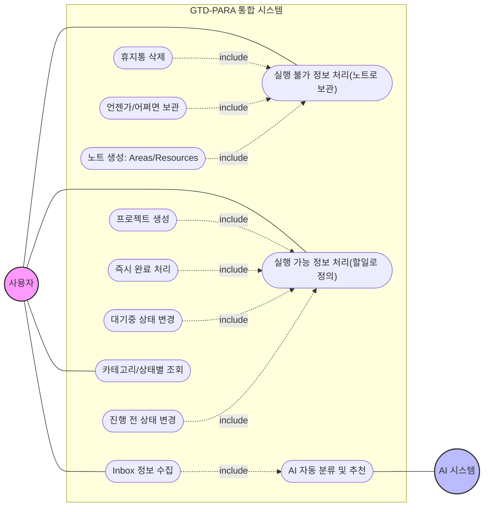

```mermaid
flowchart LR
    %% 액터 정의
    Actor_User(("사용자"))
    Actor_AI(("AI 시스템"))

    %% 시스템 경계 정의
    subgraph GTD_PARA_System [GTD-PARA 통합 시스템]
        UC1(["Inbox 정보 수집"])
        
        UC2(["실행 불가 정보 처리(노트로 보관)"])
        UC2_1(["휴지통 삭제"])
        UC2_2(["언젠가/어쩌면 보관"])
        UC2_3(["노트 생성: Areas/Resources"])
        
        UC3(["실행 가능 정보 처리(할일로 정의)"])
        UC3_1(["프로젝트 생성"])
        UC3_2(["즉시 완료 처리"])
        UC3_3(["대기중 상태 변경"])
        UC3_4(["진행 전 상태 변경"])
        
        UC4(["카테고리/상태별 조회"])
        UC5(["AI 자동 분류 및 추천"])
    end

    %% 액터 인터랙션 (유즈케이스 표준에 맞춰 실선으로 변경)
    Actor_User --- UC1
    Actor_User --- UC4
    Actor_User --- UC2
    Actor_User --- UC3
    
    UC5 --- Actor_AI

    %% 내부 확장 및 포함 관계 (관계 방향을 명확히 수정)
    UC2_1 -.-> |include| UC2
    UC2_2 -.-> |include| UC2
    UC2_3 -.-> |include| UC2
    
    UC3_1 -.-> |include| UC3
    UC3_2 -.-> |include| UC3
    UC3_3 -.-> |include| UC3
    UC3_4 -.-> |include| UC3

    UC1 -.-> |include| UC5

    %% 스타일링
    style Actor_User fill:#f9f,stroke:#333,stroke-width:2px
    style Actor_AI fill:#bbf,stroke:#333,stroke-width:2px
```