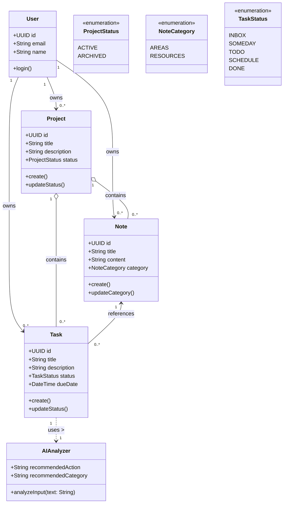

```mermaid
    classDiagram
        class User {
            +UUID id
            +String email
            +String name
            +login()
        }

    class Project {
        +UUID id
        +String title
        +String description
        +ProjectStatus status
        +create()
        +updateStatus()
    }

    class Note {
        +UUID id
        +String title
        +String content
        +NoteCategory category
        +create()
        +updateCategory()
    }

    class Task {
        +UUID id
        +String title
        +String description
        +TaskStatus status
        +DateTime dueDate
        +create()
        +updateStatus()
    }

    class AIAnalyzer {
        +String recommendedAction
        +String recommendedCategory
        +analyzeInput(text: String)
    }

    class ProjectStatus {
        <<enumeration>>
        ACTIVE
        ARCHIVED
    }
    class NoteCategory {
        <<enumeration>>
        AREAS
        RESOURCES
    }
    class TaskStatus {
        <<enumeration>>
        INBOX
        SOMEDAY
        TODO
        SCHEDULE
        DONE
    }

    User "1" --> "0..*" Project : owns
    User "1" --> "0..*" Note : owns
    User "1" --> "0..*" Task : owns
    
    Project "1" o-- "0..*" Note : contains
    Project "1" o-- "0..*" Task : contains
    
    Note "1" <-- "0..*" Task : references
    
    Task "1" ..> "1" AIAnalyzer : uses >
```
